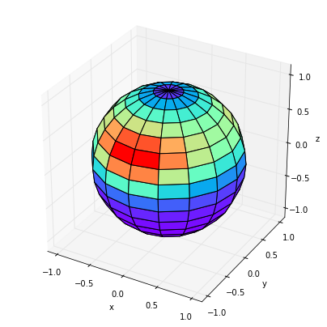

# physt 

P(i/y)thon h(i/y)stograms. Inspired (and based on) numpy.histogram, but designed for humans(TM) on steroids(TM).

The goal is to unify different concepts of histograms as occurring in numpy, pandas, matplotlib, ROOT, etc.
and to create one representation that is easily manipulated with from the data point of view and at the same time provides
nice integration into IPython notebook and various plotting options. In short, whatever you want to do with histograms,
**physt** aims to be on your side.

*Note: Version 0.3.x is feature-full while a re-design in the form of 0.4 is on the way.*

*Note: bokeh plotting backend has been discontinued (due to external library being redesigned.)*

[](https://gitter.im/physt/physt) [](https://badge.fury.io/py/physt)
[](http://physt.readthedocs.io/en/latest/)
[](https://anaconda.org/janpipek/physt)
[](https://anaconda.org/janpipek/physt)

## Simple example

```python
from physt import h1

# Create the sample
heights = [160, 155, 156, 198, 177, 168, 191, 183, 184, 179, 178, 172, 173, 175,
           172, 177, 176, 175, 174, 173, 174, 175, 177, 169, 168, 164, 175, 188,
           178, 174, 173, 181, 185, 166, 162, 163, 171, 165, 180, 189, 166, 163,
           172, 173, 174, 183, 184, 161, 162, 168, 169, 174, 176, 170, 169, 165]

hist = h1(heights, 10)           # <--- get the histogram data
hist << 190                      # <--- add a forgotten value
hist.plot()                      # <--- and plot it
```


## 2D example

```python
from physt import h2
import seaborn as sns

iris = sns.load_dataset('iris')
iris_hist = h2(iris["sepal_length"], iris["sepal_width"], "human", (12, 7), name="Iris")
iris_hist.plot(show_zero=False, cmap="gray_r", show_values=True);
```


## 3D directional example

```python
import numpy as np
from physt import special

# Generate some sample data
data = np.empty((1000, 3))
data[:,0] = np.random.normal(0, 1, 1000)
data[:,1] = np.random.normal(0, 1.3, 1000)
data[:,2] = np.random.normal(1, .6, 1000)

# Get histogram data (in spherical coordinates)
h = special.spherical_histogram(data)                 

# And plot its projection on a globe
h.projection("theta", "phi").plot.globe_map(density=True, figsize=(7, 7), cmap="rainbow")   
```



See more in docstring's and notebooks:

- Basic tutorial: <http://nbviewer.jupyter.org/github/janpipek/physt/blob/master/doc/tutorial.ipynb>
- Binning: <http://nbviewer.jupyter.org/github/janpipek/physt/blob/master/doc/binning.ipynb>
- 2D histograms: <http://nbviewer.jupyter.org/github/janpipek/physt/blob/master/doc/2d_histograms.ipynb>
- Special histograms (polar, spherical, cylindrical - *beta*): <http://nbviewer.jupyter.org/github/janpipek/physt/blob/master/doc/special_histograms.ipynb>
- Adaptive histograms: <http://nbviewer.jupyter.org/github/janpipek/physt/blob/master/doc/adaptive_histogram.ipynb>
- Use dask for large (not "big") data - *alpha*: <http://nbviewer.jupyter.org/github/janpipek/physt/blob/master/doc/dask.ipynb>
- Geographical bins . *alpha*: <http://nbviewer.jupyter.org/github/janpipek/physt/blob/master/doc/geospatial.ipynb>
- Plotting with vega backend: <http://nbviewer.jupyter.org/github/janpipek/physt/blob/master/doc/vega-examples.ipynb>

## Installation

Using pip:

`pip install physt`

Using conda (very old):

`conda install -c janpipek physt`

## Features

### Implemented

* 1D histograms
* 2D histograms
* ND histograms
* Some special histograms
  - 2D polar coordinates (with plotting)
  - 3D spherical / cylindrical coordinates (beta)
* Adaptive rebinning for on-line filling of unknown data (beta)
* Non-consecutive bins
* Memory-effective histogramming of dask arrays (beta)
* Understands any numpy-array-like object
* Keep underflow / overflow / missed bins
* Basic numeric operations (* / + -)
* Items / slice selection (including mask arrays)
* Add new values (fill, fill_n)
* Cumulative values, densities
* Simple statistics for original data (mean, std, sem)
* Plotting with several backends
  - matplotlib (static plots with many options)
  - vega (interactive plots, beta)
  - folium (experimental for geo-data)
  - plotly (very basic)
* Algorithms for optimized binning
  - human-friendly
  - mathematical
* IO, conversions
  - I/O xarray.DataSet
  - I/O JSON
  - O pandas.DataFrame

### Planned
* Rebinning
  - using reference to original data?
  - merging bins
* Statistics (based on original data)?
* Stacked histograms (with names)
* Potentially holoviews plotting backend (instead of the discontinued bokeh one)

### Not planned
* Kernel density estimates - use your favourite statistics package (like `seaborn`)
* Rebinning using interpolation - it should be trivial to use `rebin` (<https://github.com/jhykes/rebin>) with physt

Rationale (for both): physt is dumb, but precise.

## Dependencies

- Python 3.5+ targeted, 2.7 passes unit tests (hopefully)
- numpy
- (optional) matplotlib - simple output
- (optional) xarray - I/O
- (optional) astropy - additional binning algorithms
- (optional) folium - map plotting
- (optional) vega3 - for vega in-line in IPython notebook (note that to generate vega JSON, this is not necessary)
- (testing) py.test, pandas
- (docs) sphinx, sphinx_rtd_theme, ipython

## Contribution

I am looking for anyone interested in using / developing physt. You can contribute by reporting errors, implementing missing features and suggest new one.

## Alternatives and inspirations

* <https://github.com/HDembinski/histogram>
* <https://github.com/theodoregoetz/histogram>
* <https://github.com/ibab/matplotlib-hep>
* <https://github.com/diana-hep/histbook>
