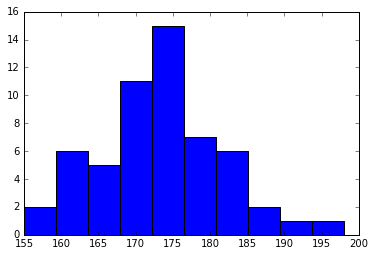
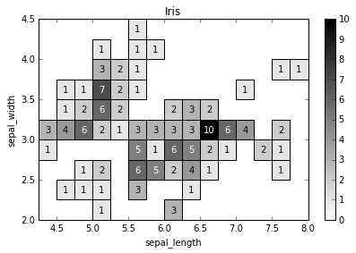

# physt

P(i/y)thon h(i/y)stograms. Inspired (and based on) numpy.histogram, but designed for humans(TM) on steroids(TM).

The goal is to unify different concepts of histograms as occurring in numpy, pandas, matplotlib, ROOT, etc.
and to create one representation that is easily manipulated with from the data point of view and at the same time provides
nice integration into IPython notebook and various plotting options. In short, whatever you want to do with histograms,
**physt** aims to be on your side.

## Simple example

```python
from physt import histogram, h2

heights = [160, 155, 156, 198, 177, 168, 191, 183, 184, 179, 178, 172, 173, 175,
           172, 177, 176, 175, 174, 173, 174, 175, 177, 169, 168, 164, 175, 188,
           178, 174, 173, 181, 185, 166, 162, 163, 171, 165, 180, 189, 166, 163,
           172, 173, 174, 183, 184, 161, 162, 168, 169, 174, 176, 170, 169, 165]
           
hist = histogram(heights, 10)
hist.plot()
```



## 2D example

```python
import seaborn as sns

iris = sns.load_dataset('iris')
iris_hist = h2(iris["sepal_length"], iris["sepal_width"], "human", (12, 7), name="Iris")
iris_hist.plot(show_zero=False, cmap=cm.gray_r, show_values=True);
```



See more in docstring's and notebooks:

- Basic tutorial: <http://nbviewer.jupyter.org/github/janpipek/physt/blob/master/doc/Tutorial.ipynb>
- Binning: <http://nbviewer.jupyter.org/github/janpipek/physt/blob/master/doc/Binning.ipynb>
- Bokeh plots: <http://nbviewer.jupyter.org/github/janpipek/physt/blob/master/doc/Bokeh%20examples.ipynb>
- 2D histograms: <http://nbviewer.jupyter.org/github/janpipek/physt/blob/master/doc/2D%20Histograms.ipynb>
- Special histograms: <http://nbviewer.jupyter.org/github/janpipek/physt/blob/master/doc/Special%20histograms.ipynb>

## Installation

`pip install physt`

## Features

### Implemented

* 1D histograms
* 2D histograms(beta)
* ND histograms(beta)
* Some special histograms
  - 2D polar coordinates (with plotting)
* Adaptive histogram from on-line filling of unknown data
* Understands any numpy-array-like object
* Keep underflow / overflow
* Basic numeric operations (* / + -)
* Items / slice selection (including mask arrays)
* Add new values (fill)
* Cumulative values, densities
* Simple statistics for original data (mean, std, sem)
* Simple plotting (matplotlib, bokeh)
  - 2D support experimental
* Algorithms for optimized binning
  - human-friendly
  - mathematical
* IO, conversions
  - I/O xarray.DataSet
  - I/O JSON
  - O pandas.DataFrame

### Planned
* Rebinning
  - using reference to original data
  - merging bins
* Statistics (based on original data)?
* Stacked histograms (with names)
* More plotting backends

## Dependencies

- numpy
- (optional) matplotlib - simple output
- (optional) bokeh - simple output
- (optional) xarray - I/O
- (optional) astropy - additional binning algorithms
- (testing) py.test, pandas
- (docs) sphinx, sphinx_rtd_theme, ipython
